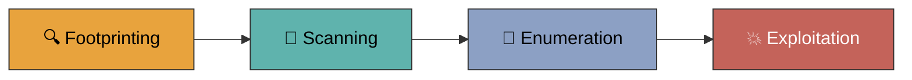
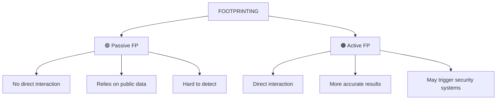
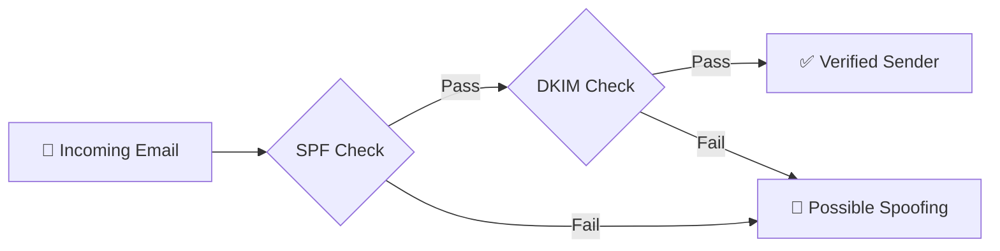
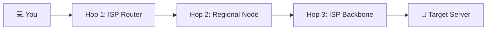
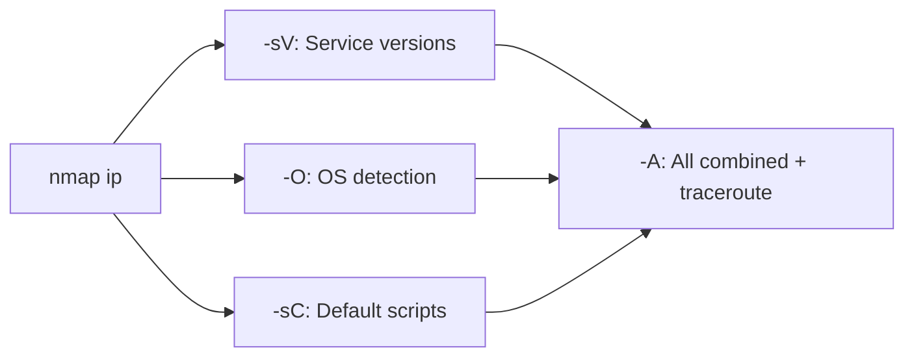
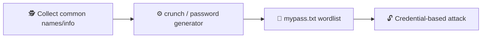

# 🕵️ Web Security Notes — Week 01: Footprinting

> **Reconnaissance — the first phase of ethical hacking**
> Passive & Active Footprinting · Search-Engine Recon · DNS Intelligence · OSINT Tools · Shodan & CVE · Nmap · Social Engineering

---

## 📑 Table of Contents

1. [Introduction to Footprinting](#1--introduction-to-footprinting)
2. [Passive vs. Active Footprinting](#2--passive-vs-active-footprinting)
3. [Search Engines & Google Dorking](#3--search-engines--google-dorking)
4. [DNS & Domain Intelligence](#4--dns--domain-intelligence)
5. [Website & Organisational Footprinting](#5--website--organisational-footprinting)
6. [Network Path Analysis](#6--network-path-analysis)
7. [Historical Data — archive.org](#7--historical-data--archiveorg)
8. [Automated OSINT Tools](#8--automated-osint-tools)
9. [Shodan & CVE](#9--shodan--cve)
10. [Nmap — Bridge into Scanning](#10--nmap--bridge-into-scanning)
11. [Social Engineering & Human-Layer Footprinting](#11--social-engineering--human-layer-footprinting)
12. [Summary](#12--summary)

---

## 1. 🌐 Introduction to Footprinting

**Footprinting** is the **first phase of ethical hacking**. It's the systematic process of collecting information about a target **system, network, or organisation** — long before any direct attack is attempted.

Everything gathered here (domain details, tech stack, employee info, exposed files, network structure) feeds directly into the next phases of a pentest.

> 💡 **Definition:** Footprinting is the process of collecting information about a target system, network, or organisation, without necessarily engaging with it directly.



---

## 2. ⚖️ Passive vs. Active Footprinting

Footprinting techniques split into two categories, based on whether the attacker **directly interacts** with the target.



| | 🟢 **Passive Footprinting** | 🟠 **Active Footprinting** |
|---|---|---|
| **Interaction** | No direct interaction with target system | Direct interaction with target system/network |
| **Data source** | Publicly available data (websites, records, social media) | Live probing of the target |
| **Accuracy** | Lower — inferred from public sources | Higher — precise, real-time results |
| **Detectability** | ✅ Very hard to detect | ⚠️ Can be flagged by security/monitoring systems |
| **Examples** | WHOIS, Google dorking, archive.org, social media OSINT | Network scanning, port scanning, DNS queries, Nmap |
| **Risk level** | 🟢 Low | 🔴 High |

---

## 3. 🔎 Search Engines & Google Dorking

Search engines are among the most powerful **passive** footprinting tools — they index vast amounts of public data, some of which was never meant to be found.

### 3.1 Advanced Search Operators

| Operator | Purpose | Example |
|---|---|---|
| `site:` | Restrict results to a specific domain | `site:target.com` |
| `filetype:` | Locate specific file types | `filetype:pdf "admin"` |
| `inurl:` / `allinurl:` | Find pages containing a term in the URL | `inurl:admin` |
| `intitle:` | Find pages containing a term in the title | `intitle:"index of"` |

### 3.2 🕳️ Sensitive Information Discovery (Google Dorking)

Chaining these operators locates misconfigured pages, admin login panels, and exposed data:

```bash
inurl:admin filetype:pdf "python project"
inurl:*.conf
inurl:admin/login site:*.xx
```

> ⚠️ **If you suspect a malicious IP** — cross-check it on [virustotal.com](https://www.virustotal.com) before investigating further.
>
> ⚠️ **For a suspicious email** — search it in breach-lookup tools, then pair any leaked password with the email in an `OR` search to check for password reuse.

### 3.3 🧩 Fingerprinting Technology

- 🔌 **Plugins:** Wappalyzer & Netcraft extension → reveal CMS, frameworks, server tech
- 🗂️ **CMS:** Content Management System (e.g. WordPress, Joomla) — often the first thing worth identifying

---

## 4. 🌍 DNS & Domain Intelligence

Domain and DNS records reveal a lot about an org's infrastructure — mail servers, hosting, and network ownership.

### 4.1 Lookup Tools

| Tool | Purpose |
|---|---|
| `whois` | Domain registration details — owner, registrar, creation date |
| `nslookup` | Resolve a domain to IP address(es) + query DNS records |
| `dnslookup` | General-purpose DNS record lookup |
| **MX Toolbox** | MX record lookup + ASN lookup in one dashboard |

### 4.2 📧 Email Footprinting

- **SMTP** — Simple Mail Transfer Protocol, used to *send* mail; often probed to confirm valid usernames
- **SPF record lookup** — checks whether a domain can be spoofed
- **DKIM** — DomainKeys Identified Mail; cryptographic signature that verifies an email's true origin, alongside SPF



---

## 5. 🏢 Website & Organisational Footprinting

An organisation's own website is often its **single richest source** of footprinting data.

### 5.1 Publicly Available Information

- 🏭 **Company details** — services, infrastructure, and partners often described in plain text
- 👥 **Employee & contact details** — staff directories, email addresses, support contacts
- 🧬 **Technical clues** — website code, metadata, and page structure reveal underlying tech (confirmed via Wappalyzer)

### 5.2 📄 robots.txt

`/robots.txt` tells web crawlers (Google, Yahoo!, etc.) which parts of a site **not** to index — saving bandwidth & server resources.

```
User-agent: *
Disallow: /admin/
Disallow: /internal-docs/
Crawl-delay: 10
```

> 🎯 **Footprinting angle:** By listing the paths it wants hidden, `robots.txt` often hands a footprinter a ready-made map of an organisation's most sensitive directories.

---

## 6. 🛰️ Network Path Analysis

### 6.1 NeoTrace

A **graphical** network tool used to visually analyse the path between two systems — far easier to read than raw CLI traceroute.

- 🗺️ **Route visualisation** — path between user & target, with intermediate nodes
- 📍 **Network info** — IP addresses, network providers, geographical locations
- 🏗️ **Infrastructure mapping** — helps identify systems involved in communication

### 6.2 CLI & Web Alternatives

| Tool | Notes |
|---|---|
| `traceroute` (Kali terminal) | Shows the path taken to reach the target site |
| `traceroute-online.com` | Web-based traceroute — no terminal needed |
| `whois` / `nslookup` / `dnslookup` | Add ownership & DNS context to the route |



---

## 7. 🗄️ Historical Data — archive.org

The **Wayback Machine** stores historical website snapshots — an often-overlooked passive footprinting resource.

- 🕰️ **Old website data** — archived pages may show info since removed from the live site
- 🏛️ **Tech & structure insights** — older snapshots reveal past server configs and site structures
- 🔓 **Hidden/removed content** — sensitive data once public may still be visible in old snapshots

> **Workflow:** `archive.org` → search website → browse snapshots by date

---

## 8. 🤖 Automated OSINT Tools

| Tool | Function |
|---|---|
| 🌾 `theHarvester` | Aggregates emails, subdomains, hosts from public sources |
| 🔎 `dmitry` | Deepmagic Information Gathering Tool — all-in-one OSINT utility |
| 🌐 `whatweb` | Fingerprints web tech (similar to Wappalyzer) |
| 🛡️ `wafw00f` | Detects if a target is behind a Web Application Firewall |
| 🕷️ `SpiderFoot` | Automated OSINT scan — `spiderfoot -l <ip address>` or via web UI |

**SpiderFoot web UI workflow:**
```
1. Name the scan
2. Set the target site
3. Run scan now
```

---

## 9. 🛰️ Shodan & CVE

### 9.1 Shodan

A search engine for **internet-connected devices**, not web pages — indexes exposed webcams, servers, industrial systems worldwide.

```bash
# Example Shodan dorks
webcamxp
windows 7 sp1
sqli
```

### 9.2 🐛 CVE — Common Vulnerability Exposure

A **CVE** is a publicly catalogued, known vulnerability in software/hardware. Once tech is fingerprinted (Wappalyzer/whatweb), check its version against CVE databases for known exploits.

### 9.3 Lab Setup Reference

```bash
sudo service ftp start
sudo ufw allow 21/tcp
```

---

## 10. 🛠️ Nmap — Bridge into Scanning

Nmap sits right at the boundary between footprinting and the next phase: **scanning**.

| Command | Result |
|---|---|
| `nmap <ip>` | Default scan — lists open ports |
| `nmap -sV <ip>` | Detects service versions on open ports |
| `nmap -O <ip>` | Attempts OS detection |
| `nmap -A <ip>` | Aggressive scan — OS + version + script + traceroute |
| `nmap -sC <ip>` | Runs Nmap's default script set |



---

## 11. 🎭 Social Engineering & Human-Layer Footprinting

Not all recon is technical — social engineering manipulates **people**, or simply observes their behaviour, to extract sensitive info.

### 11.1 👂 Eavesdropping
Listening to private conversations over channels like phone calls to collect useful info.

> **Wireshark** 🦈 — a network-capturing tool. Visiting any **HTTP** (non-HTTPS) site while Wireshark runs a `tcp.port==80` filter reveals the underlying communication in **plain text**.

### 11.2 👀 Shoulder Surfing
Observing someone entering confidential data (passwords, email credentials) — typically over their shoulder.

### 11.3 🗣️ Human Interaction Techniques
Attackers trick employees into revealing info through ordinary conversation or deliberate deception — often faster than beating technical defences.

### 11.4 🔑 From Collected Names to Password Lists

Names/personal details gathered via social engineering can seed custom password-list generation.

```bash
# Kali Linux — generate an 8-character password list
crunch 8 8 -t Pass@%@ -o mypass.txt
#            ↑    ↑   ↑
#          min  max  %=symbol, @=capital & small letters
```



---

## 12. ✅ Summary

Footprinting is the **foundation** of any ethical-hacking engagement. Whether passive (search engines, DNS, archived pages) or active (direct network scanning), the goal is the same: build a complete, accurate picture of the target before moving into scanning and enumeration.

### 🎯 Key takeaways for Week 02

- ✅ Exhaust **passive** reconnaissance before moving to active techniques
- ✅ Search-engine operators, WHOIS/DNS lookups, and archive.org form the backbone of passive footprinting
- ✅ Nmap marks the natural transition from footprinting → active scanning
- ✅ The **human layer** (social engineering) remains one of the most effective, under-defended attack surfaces

---

<p align="center">
  <sub>📚 Web Security — Learning Notes · Week 01 · Footprinting</sub>
</p>
